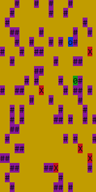

## ChaseGame

Implementation of the console the ChaseGame

**Designations**:  
`o` - position of a player (program user) on the map. 
`#` - obstacle 
`x` - enemy (artificial intelligence) 
`O` - target point the player must get to before the enemies reach the player. The player is considered to have reached the target cell if they stepped on its position.

**Game rules**:
1. Each participant (player and enemies) may make one move. Then, it's another participant's turn. The enemy is considered to have reached the player if it can step on the player's position by making the current move.
2. Available movement directions are left, right, downward, and upward.
3. If an enemy is unable to move forward (there are obstacles or other enemies around them, or a map edge has been reached), the enemy skips a move.
4. The target point is an obstacle for an enemy.
5. If the player is unable to move forward (surrounded by obstacles, enemies, or has reached an edge of the map), the player loses the game.
6. The player loses if an enemy finds them before they reach the target point.
7. The player starts the game first.

**Implementation requirements**:
1. Field size, number of obstacles, and number of enemies are entered into the program using command-line parameters (their availability is guaranteed): 
`$ java -jar game.jar --enemiesCount=10 --wallsCount=10 --size=30 --profile=production`
2. Enemies, obstacles, the player, and the target point are positioned on the field randomly. 
3. To make a move, the player shall enter a number in the console that corresponds to the movement direction A, W, D, S (left, upward, right, downward).
4. If the player is unable to make a move in the specified direction, another number (direction) shall be entered.
5. If the player understands in the beginning or middle of the game that the target point is unreachable, they shall end the game by entering 9 (player loses).
6. Once the player has made a move, it is its enemy's turn to make a move towards the player. 
7. In the development mode, each enemy's step is confirmed by the player by entering 8.

**Architecture requirements**:
1. Two projects is implemented: Game (contains game logic, application entry point, output functionality, etc.) and ChaseLogic (contains pursuing algorithm implementation).
2. Both are mavenprojects, and ChaseLogic is added as a dependency to pom.xml inside Game.
3. Game.jar archive is portable:  JCommander and JCDP must be directly included in the archive. At the same time, all libraries connected to the project are declared as maven-dependency.

There is a configuration file called application-production.properties. In this file, you can specify your application settings. The example of this file is shown below:

enemy.char = X  
player.char = o  
wall.char = \#  
goal.char = O  
empty.char=  
enemy.color = RED  
player.color = GREEN  
wall.color = MAGENTA  
goal.color = BLUE  
empty.color = YELLOW

This configuration file is located in resources folder of the launched jar archive.

In addition to that, application-dev.properties file is implemented. Structure of this file is similar to that of application.properties. Here, you can specify parameters for distinguishing application startup in development mode (for example, different colors/characters for map components).

The program mode is passed via the --profile parameter.

to start game:

* bash install.sh
* java -jar game.jar --enemiesCount=5 --wallsCount=50 --size=20 --profile=production
